<h1 align="center">Valheim Server UI</h1>

<p align="center">
  Run, configure, back up and mod <b>Valheim dedicated servers on Linux</b> from a web browser.<br/>
  One static binary. Native SteamCMD installs. systemd-supervised instances. Multi-user with SSO.
</p>

<p align="center">
  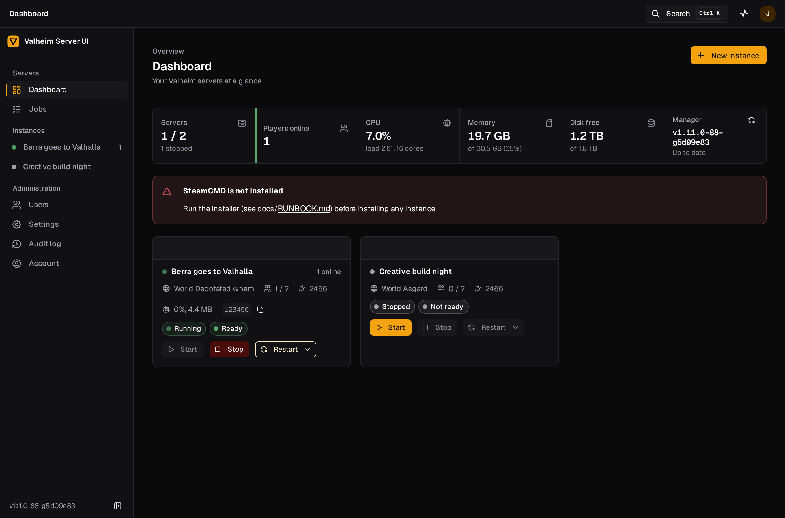
</p>

---

## Why

Running a Valheim server on Linux means juggling SteamCMD, a start script full of
quoted flags, `adminlist.txt`, world files that need backing up, BepInEx plugins
and their `.cfg` files, and a restart every time Iron Gate ships a patch. This
project puts all of that behind a clean web UI with proper forms, live logs and
an audit trail, without turning your server box into a Docker puzzle.

## Features

| Area | What you get |
|------|--------------|
| **Instances** | Several isolated servers per host, each with its own game install, world folder, ports and systemd unit. Start, stop, restart, autostart. |
| **Configuration** | Real form controls for every server option: name, world, password, port, public, crossplay, difficulty preset, every combat/death/resource/raid/portal modifier, world keys, save interval, Valheim's own rolling saves. Validation with the same rules Valheim enforces. |
| **Live console** | Streams the server log in real time with filter, follow, download, and highlighting for ready/join/leave/save events. |
| **Players** | Online players (via the query port and the log), a history of everyone who ever joined, and editors for the admin, banned and permitted lists. |
| **Backups & worlds** | One-click or scheduled world backups, retention policy, restore with an automatic safety backup, world upload/download, switch the active world. |
| **Mods** | Install BepInEx, browse and install from Thunderstore with dependency resolution, upload zips or DLLs, enable/disable/update/uninstall, and edit plugin `.cfg` files with typed inputs. |
| **Schedules** | Cron-based restarts, backups and Steam update checks with a "only when nobody is online" switch. |
| **Updates** | Detects new Valheim builds on Steam and updates with an optional pre-update backup. |
| **Self-upgrade** | The manager polls GitHub releases, shows what's new, and upgrades itself from the UI with a verified download, atomic swap and rollback. Game servers keep running while it restarts. |
| **Users & SSO** | First-run wizard creates the admin. Local accounts plus one OIDC provider (Authelia, Keycloak, Authentik, Google…) with group-to-role mapping. Roles: viewer, operator, admin. |
| **Operations** | Job queue with live logs for every long operation, audit log of every change, disk usage and SteamCMD health on the dashboard. |
| **Security** | The manager runs unprivileged; its only path to root is a 15-line sudo wrapper that validates its arguments. Argon2id passwords, hardened session cookies, CSRF guard, no default credentials. |

## Screenshots

<table>
  <tr>
    <td align="center"><b>Instance overview</b><br/>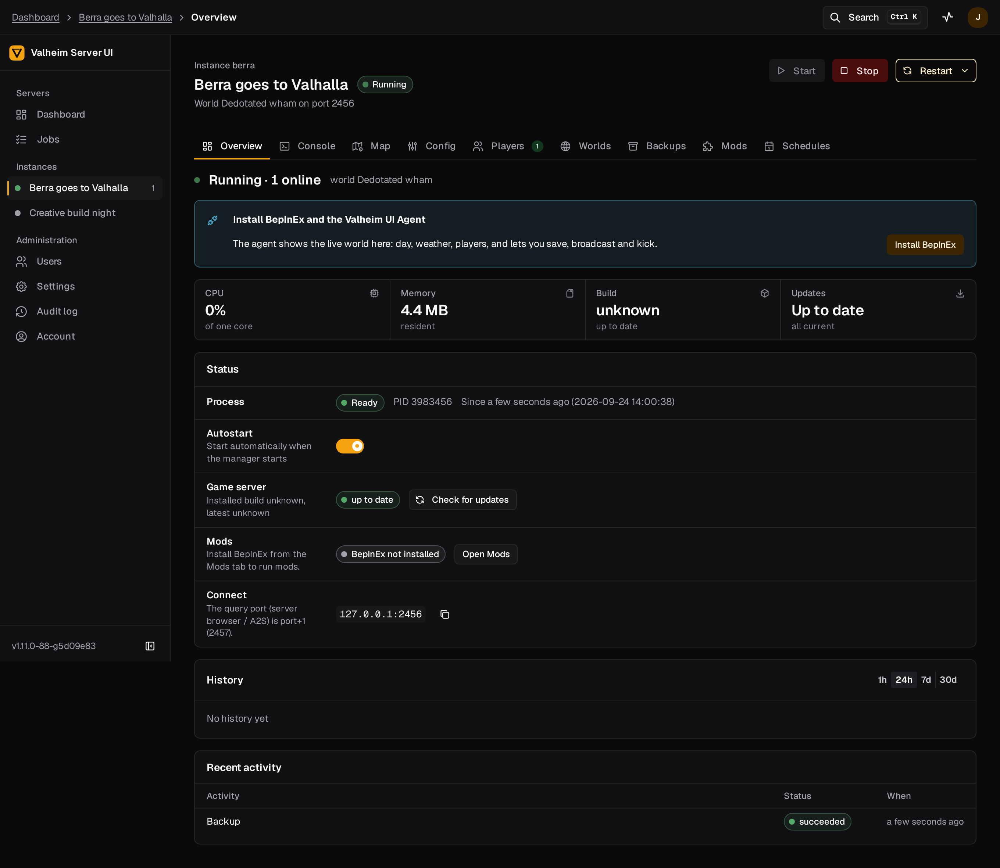</td>
    <td align="center"><b>Live console</b><br/>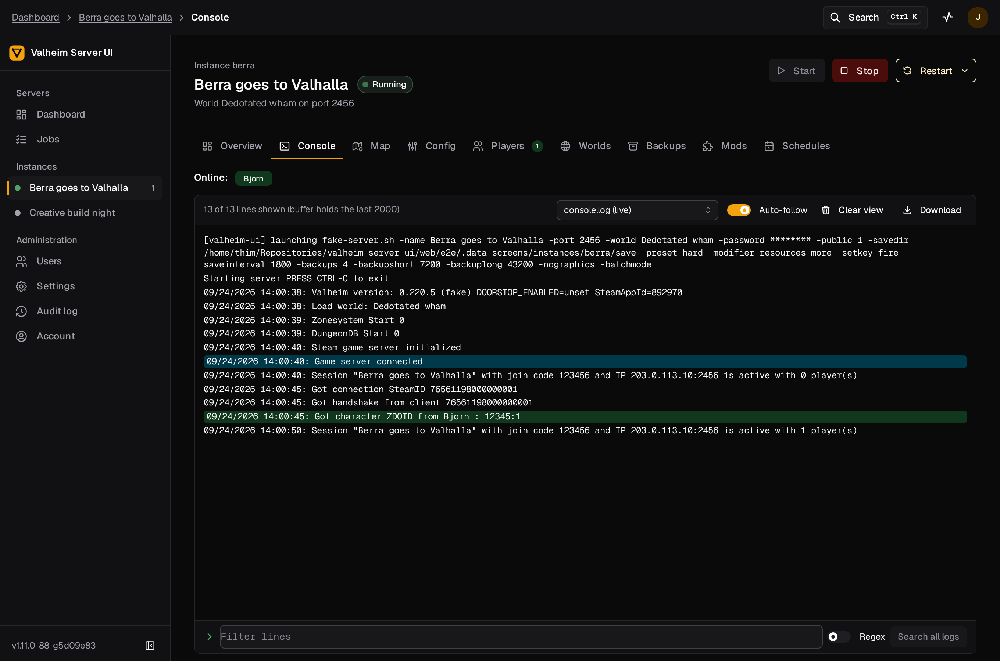</td>
  </tr>
  <tr>
    <td align="center"><b>Server configuration</b><br/>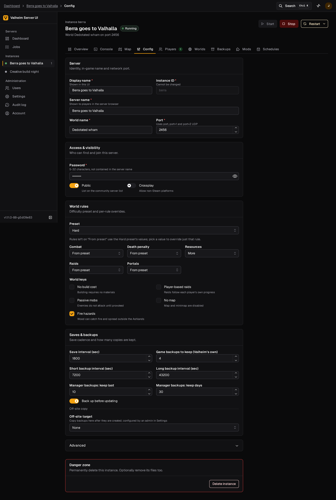</td>
    <td align="center"><b>Players and lists</b><br/>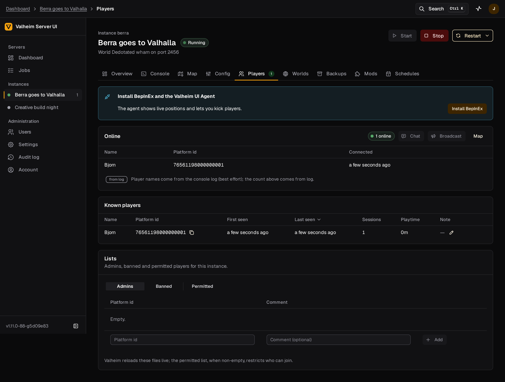</td>
  </tr>
  <tr>
    <td align="center"><b>Mods and config editor</b><br/>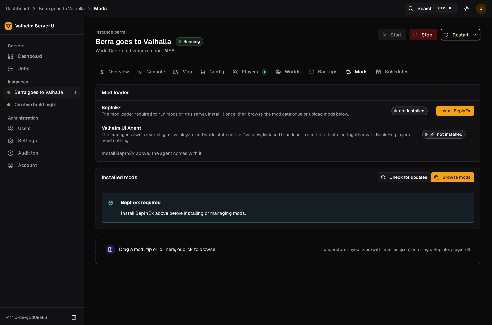</td>
    <td align="center"><b>Thunderstore browser</b><br/>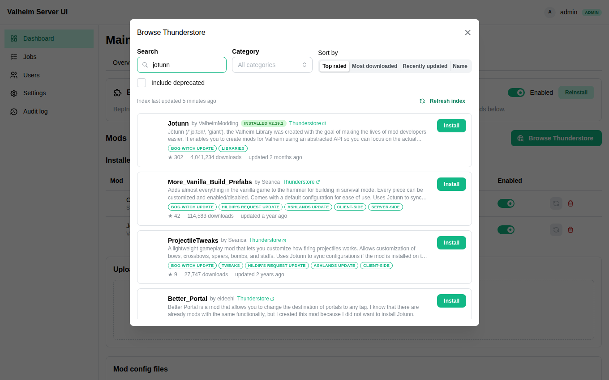</td>
  </tr>
  <tr>
    <td align="center"><b>Backups</b><br/>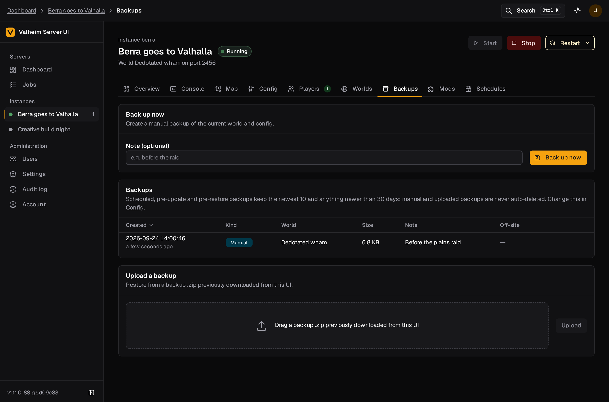</td>
    <td align="center"><b>Schedules</b><br/>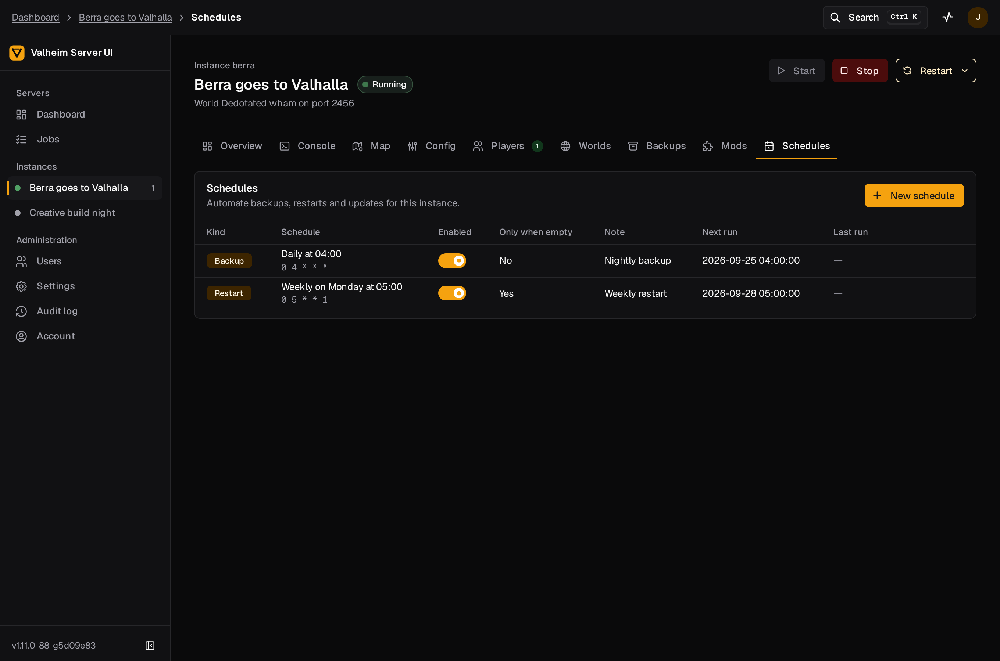</td>
  </tr>
  <tr>
    <td align="center"><b>Jobs</b><br/>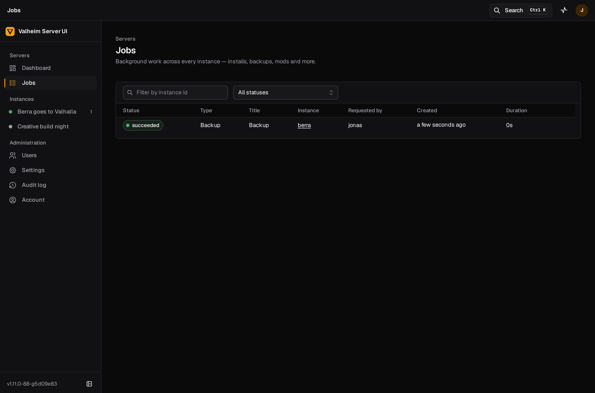</td>
    <td align="center"><b>Users</b><br/>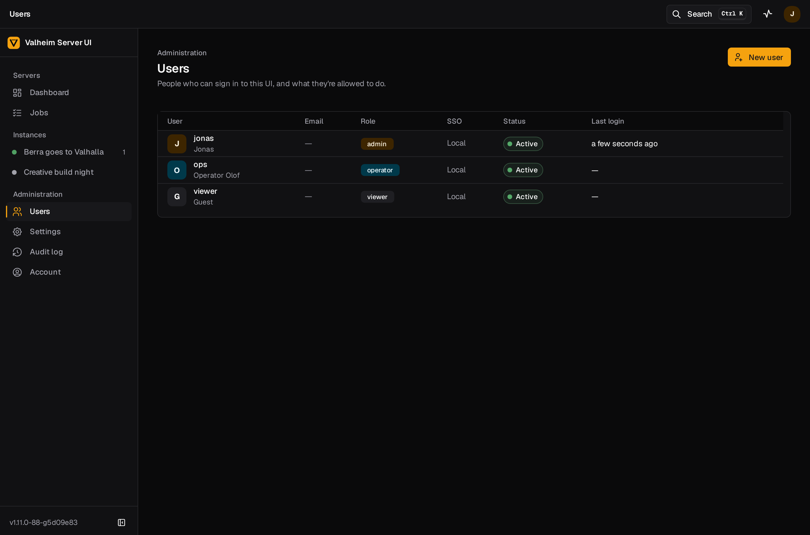</td>
  </tr>
  <tr>
    <td align="center"><b>Settings and SSO</b><br/>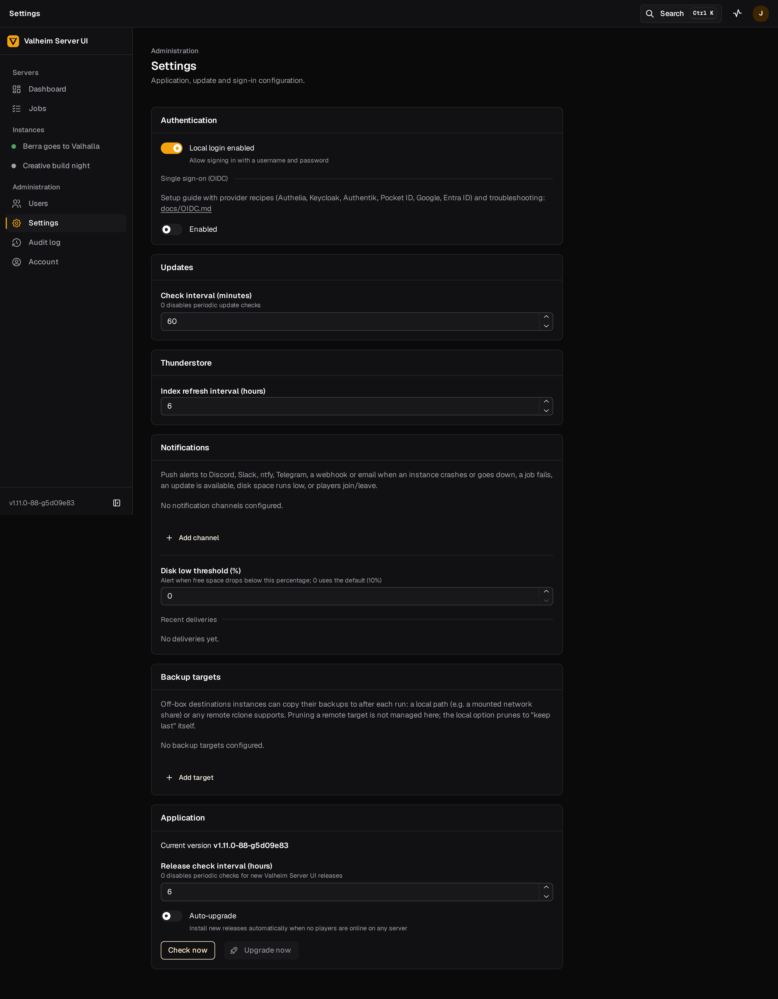</td>
    <td align="center"><b>Login</b><br/>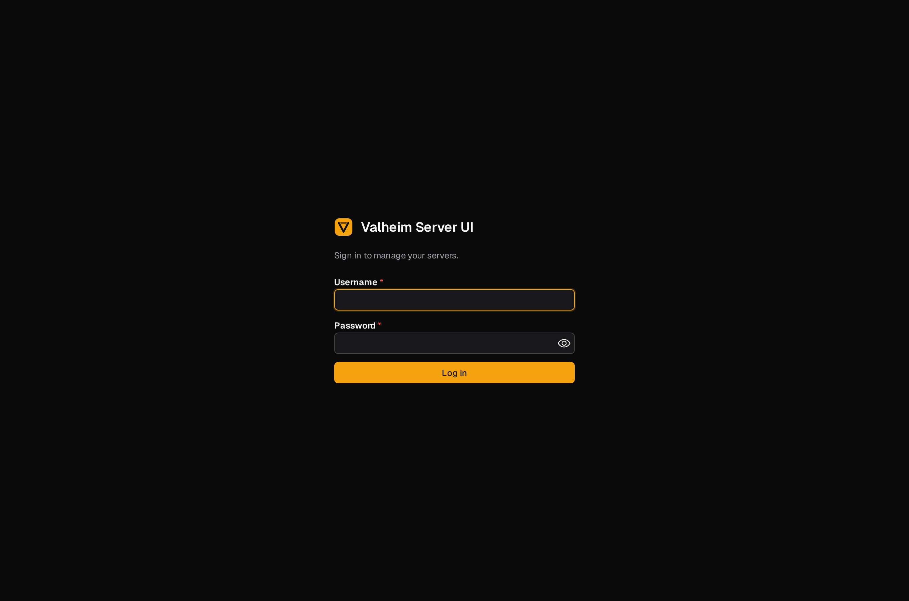</td>
  </tr>
</table>

## Install

Requirements: Debian 12+ or Ubuntu 22.04+ on x86_64 with systemd, root access,
about 2 GB of disk per instance plus room for backups.

One command, nothing else to download by hand:

```bash
curl -fsSL https://raw.githubusercontent.com/jonasthim/valheim-server-ui/main/deploy/install.sh | sudo bash
```

The installer creates the `valheim` system user and `/var/lib/valheim`, installs
the binary (to `/var/lib/valheim/bin`, symlinked from `/usr/local/bin/valheim-ui`),
the sudo wrapper, the systemd units and SteamCMD, verifies the release's
checksum, then starts the service on `127.0.0.1:8080`. Re-running it upgrades in
place and never touches your data.

Local build instead of a release (installer script and repo checked out already):

```bash
make build && sudo ./deploy/install.sh --binary bin/valheim-ui
```

Before installing or upgrading, see what would change without touching
anything:

```bash
sudo ./deploy/install.sh --check
```

Put a TLS reverse proxy in front for remote access and set `base_url` in
`/etc/valheim-ui/config.yaml` (Caddy and nginx snippets are in the
[runbook](docs/RUNBOOK.md#2-reverse-proxy-and-tls)). For a trusted LAN only,
`sudo ./deploy/install.sh --listen 0.0.0.0:8080` works too.

## First run

1. Open the UI. Because no users exist yet, it shows the **setup wizard**; create
   the administrator account. There are no default credentials, and the wizard
   disappears once the first account exists.
2. Click **New instance**. Give it a display name, a server name, a world name, a
   password (5 to 32 characters, not contained in the server name) and a port.
   Leave **Download game files now** on.
3. Watch the SteamCMD install under **Jobs** (a couple of minutes on a fast link).
4. Open the instance and press **Start**. The overview turns green when the world
   has loaded; with crossplay on, the join code appears next to the player count.
5. Open UDP ports `port`, `port+1` and `port+2` on your firewall and router.

## How to

**Change server settings.** Instance → Config. Every option is a switch, dropdown,
checkbox or number field with inline help. Saving while the server runs shows a
"restart required" banner; press Restart when convenient.

**Make someone an admin, ban a player.** Instance → Players. Pick a known player
from the history (the UI records everyone who ever joined) or paste a platform id.
Valheim reloads these files live; no restart needed.

**Back up and restore.** Instance → Backups. "Back up now" zips the world and the
player lists. Restore stops the server if you ask it to, takes a safety backup
first, restores, and starts it again. Manual and uploaded backups are never
auto-deleted; scheduled ones follow the retention policy in Config.

**Install mods.** Instance → Mods → Install BepInEx (the server must be stopped;
the UI can stop and restart it for you). Then Browse Thunderstore, pick a mod and
its version; dependencies are resolved and installed automatically and the plan
is printed in the job log. Plugin `.cfg` files show up below as typed forms.

**Keep the server up to date.** The overview shows when Steam has a newer build.
"Update now" stops, backs up, updates and restarts. For hands-off operation add a
schedule of kind *update* with "only when empty" on.

**Upgrade Valheim Server UI itself.** The dashboard and Settings → Application
show when a new release is out, with its release notes. Press Upgrade: the
manager downloads the release, verifies its checksum, sanity-runs the new
binary, swaps it in atomically and restarts within seconds; the page reconnects
on the new version. Your game servers are separate systemd units and keep
running throughout. Turn on *auto-upgrade* to have this happen automatically
when nobody is online. Rollback on the host: `valheim-ui self-upgrade --rollback`.

**Schedule restarts.** Instance → Schedules → New schedule, kind *restart*, pick a
preset such as "Daily at 04:00". Valheim has no way to warn players, so keep
"only when empty" on unless your players know the routine.

**Add users or SSO.** Users → Create user (viewer, operator or admin). For single
sign-on, Settings → Authentication → OIDC: issuer URL, client id and secret, map
your groups to roles, press "Test connection", save. The redirect URI to register
at the provider is shown in the form. Keep one local admin until SSO is proven.
Provider recipes and troubleshooting: [docs/OIDC.md](docs/OIDC.md).

**Run several servers.** Create another instance with a different port range
(each uses three consecutive UDP ports). Each instance has its own game install,
so mod sets can differ.

More operational detail, including upgrades, host-level backups and
troubleshooting, is in [docs/RUNBOOK.md](docs/RUNBOOK.md); single sign-on setup
for Authelia, Keycloak, Authentik, Pocket ID, Google and Entra ID is in
[docs/OIDC.md](docs/OIDC.md).

## Roles

| Role | Can |
|------|-----|
| viewer | See everything except secrets (passwords are masked). |
| operator | Start/stop/configure instances, players, backups, worlds, mods, schedules. |
| admin | Everything, plus create/delete instances, manage users and settings, read the audit log. |

## How it works

```
Browser ──HTTPS (your proxy)──► valheim-ui (Go, unprivileged)
                                   │ sudo unitctl start|stop|restart <id>   (only root path)
                                   ▼
                           systemd valheim@<id>.service
                                   │ ExecStart: valheim-ui launch --instance <id>
                                   ▼
                           valheim_server.x86_64  ── stdout ──► console.log ──► live UI
```

The manager renders each instance's command line into `launch.json`; the
`launch` subcommand execs the real server binary with the right environment,
including the BepInEx doorstop variables read from the pack's own start script.
The manager tails the console log for readiness, join codes and players, and
polls the Steam query port for the authoritative player count. Everything else
(SteamCMD, Thunderstore downloads, backups) runs as tracked jobs with streamed
logs. Full design: [docs/ARCHITECTURE.md](docs/ARCHITECTURE.md).

## Development

```bash
make deps         # go mod download + npm ci
make build        # frontend build + Go build → bin/valheim-ui
make check        # vet, golangci-lint, go test -race, typecheck, lint
make e2e          # Playwright suite against a fake game server
make dev-backend  # backend on :8080 (direct supervisor + fake server, no systemd needed)
make dev-web      # Vite dev server on :5173 with API proxy
```

Requirements: Go 1.26, Node 22. The API contract is `docs/openapi.yaml`; frontend
types are generated from it (`make gen`). Dependencies stay on their latest
majors with zero known vulnerabilities; CI runs `govulncheck` and `npm audit`.

## Status and non-goals

v1 targets a single Linux host with systemd. Not in scope: Docker-based game
runtime, arm64, Valheim Plus, in-game chat/RCON, multi-host management, TLS
termination (use a reverse proxy).

## License

MIT
